> 🐍 Ask Sage Python Client v1.2.4

#  <center> Ask Sage API - Overview </center>

 <center>  </center>

Welcome to the Ask Sage Overview repository! 🎉

This repository is a work in progress project 👷 and is intended to be a collection of sample code 🧑‍💻 and documentation 📄 on interacting with Ask Sage via the Ask Sage API. Additional content may include actual steps 🪜 within the Ask Sage platform, but for the most part this repository will focus on utilizing the API and creating mini proof-of-concept projects. 

> Examples provided will cover a wide range of topics related to generative AI and will be designed to be accessible to users with varying levels of experience with AI and programming. At the moment we have provided a list of ideas of what will be covered in this repository and will be updated as more content is added. 

*Note: Only the Ask Sage API is available to paid subscribers.* 💵😭

This is a community-driven effort to provide additional resources and examples for users of Ask Sage 🚀.

Visit the official AskSage website [here](https://www.asksage.ai/).

If you are interested in contributing to this repository, please see the [Contributing Guidelines](CONTRIBUTING.md) for more information.

If you have any questions or need help, feel free to reach out to the maintainers of this repository or the Ask Sage team directly.

--------------------------------

Additional resources: 

- Discord - Ask Sage 💬 [Join Here](https://discord.gg/upxuAdNvjY)
- Ask Sage - User Documentation [Ask Sage User Documentation](https://docs.asksage.ai/)

--------------------------------

<span style="color:yellow;font-size:smaller;font-style:italic">Note: the content in this repository may be outdated or incorrect, so please refer to the official AskSage documentation for the most up-to-date information.</span>

# Table of Contents
- [ Ask Sage API - Overview ](#-ask-sage-api---overview-)
- [Table of Contents](#table-of-contents)
  - [What is Ask Sage?](#what-is-ask-sage)
  - [What models are available?](#what-models-are-available)
  - [How to access Ask Sage?](#how-to-access-ask-sage)
  - [Ask Sage API](#ask-sage-api)
    - [API Endpoints Overview](#api-endpoints-overview)
      - [User API:](#user-api)
      - [Server API:](#server-api)
      - [Python API Client Endpoints:](#python-api-client-endpoints)
    - [Generating API Keys](#generating-api-keys)
    - [API Authentication Set Up](#api-authentication-set-up)
      - [1. Ask Sage Python API Client](#1-ask-sage-python-api-client)
      - [2. 24 Hour - Access Token](#2-24-hour---access-token)
      - [3. Static API Key](#3-static-api-key)
    - [Examples](#examples)
      - [0. AI Ethics](#0-ai-ethics)
      - [1. API Endpoints](#1-api-endpoints)
      - [2. Prompt Engineering](#2-prompt-engineering)
      - [3. Custom Dataset](#3-custom-dataset)
      - [4. Comparing LLM Models](#4-comparing-llm-models)
      - [5. Diagram Creation With LLMs](#5-diagram-creation-with-llms)
      - [6. LLM Deployment On A Edge Device](#6-llm-deployment-on-a-edge-device)
      - [7. LLM Evaluation and Monitoring Dashboard](#7-llm-evaluation-and-monitoring-dashboard)
      - [8. LLM Chatbot Network](#8-llm-chatbot-network)
    - [9. Additional Requested Examples](#9-additional-requested-examples)
    - [Error Handling](#error-handling)
    - [Best Practices](#best-practices)
  - [Other Resources Related to GenerativeAI (GenAI)](#other-resources-related-to-generativeai-genai)
  - [Definitions To Know](#definitions-to-know)
  - [Video](#video)
  - [Requested Features or Enhancements to Ask Sage API](#requested-features-or-enhancements-to-ask-sage-api)
    - [Issues](#issues)
    - [Enhancements](#enhancements)
  - [Bugs or Issues](#bugs-or-issues)
  - [License](#license)
  - [Sources](#sources)
  - [Tools Used](#tools-used)

## What is Ask Sage? 
AskSage is a agnostic Generative AI platform that gives access to a wide range of AI models and tools. The platform is designed to be easy to use and integrate into existing workflows that can be further customized to meet the needs of the user/organization.

## What models are available?
Uniquely designed to be agnostic, Ask Sage provides access to a wide range of models that can be used for a variety of tasks. Some of the models available include but not limited to:

<center>

| Model Name | Description |
|------------------|-------------------------------------------------------------------------------------------------|
| Azure OpenAI | Cutting-edge language models developed by OpenAI and hosted on the Azure platform. |
| Azure Gov OpenAI | Cutting-edge language models developed by OpenAI and hosted on the Azure Gov platform. |
| Google Gemini Pro | Language models developed by Google and optimized for various natural language processing tasks. |
| LLMA3 | A large language model developed by Meta that excels in generating high-quality text. |
| Mistral | A powerful language model developed by Mistral that can generate creative and coherent text. |
| Claude 3 | A language model developed by Anthropic that focuses on generating code and programming-related text. |
| Cohere | A language model developed by Cohere Technologies that specializes in generating code. |
| OpenAI Whisper | A language model developed by OpenAI that enables speech-to-text capabilities. |
| DALL-E v3 | A language model developed by OpenAI that specializes in generating images. |
</center>

Here is the actual list of available models on the Ask Sage platform as of Oct 22, 2024:  

```python
models = ['aws-bedrock-titan', 'llma3', 'claude2', 'claude-3-opus', 'claude-3-sonnet', 'claude-35-sonnet', 'cohere', 'mistral-large', 'gpt-gov', 'gpt4-gov', 'gpt', 'gpt4', 'gpt4-32k', 'gpt35-16k', 'gpt4-vision', 'gpt-4o', 'gpt-4o-mini', 'dall-e-2', 'dall-e-3', 'google-bison', 'google-gemini-pro', 'gpt-4o-gov', 'groq-70b', 'gpt-o1', 'gpt-o1-mini', 'xai-grok']
```

> <span style="color:yellow">More models can be added by the Ask Sage team that are specific to a user's needs. (additional costs may apply)</span>


**Note:** The models listed above are subject to change and more models may be added in the future. 

## How to access Ask Sage? 
There are two main ways to interact with Ask Sage:

1. **Ask Sage Platform** - The Ask Sage platform provides a user-friendly interface that allows users to interact with the models and tools available on the platform. Users can input text, files, code, or other data and receive generated output from the models.
2. **Ask Sage API** - The Ask Sage API allows users to interact with the models and tools available on the platform programmatically. Users can send requests to the API and receive responses in JSON format. This allows for more flexibility and customization in how users interact with the models.
   1. Must be a registered user and be a paid subscriber to access the API. 

## Ask Sage API 
The Ask Sage API provides a RESTful interface for interacting with the models available through the platform. Users can send requests to the API and receive responses in JSON format. The API is designed to be easy to use and integrate into existing workflows. 

Overall, this repository will provide setup instructions, examples, and other resources as one begins to explore the capabilities of Generative AI and how it can be used in real-world scenarios.

### API Endpoints Overview

The Ask Sage API is documented using Swagger, which provides detailed information about the available endpoints, request parameters, response formats, and authentication methods.

#### User API:
- Documentation: https://app.swaggerhub.com/apis-docs/NICOLASCHAILLAN_1/user-api/1.0
- The Base URL for the User API is: [ Base URL: api.asksage.ai/user/ ]

> The following table shows the available endpoints in the User API:

<center>

| Endpoint | Description |
|:---:|:---:|
| /get-token-with-api-key | Get an access token with API Key and email |
| /get-user-logins | Get your last logins (limited to 5 by default) |
| /get-user-logs | Get your last prompts |
| /add-dataset| Add a new dataset |
| /delete-datasets| Deletes a dataset |
</center>

#### Server API: 
- Documentation: https://app.swaggerhub.com/apis-docs/NICOLASCHAILLAN_1/server_ask-sage_api/1.0
- The Base URL for the Server API is: [ Base URL: api.asksage.ai/server/ ]

This information is used to interact with the Ask Sage API. The user can query models, select/get personas, get datasets, train models and more. 

> The following table shows the available endpoints in the Server API:

<center>

| Endpoint | Description |
|:---:|:---:|
| /get-models | Returns a list of available models via the Ask Sage services |
| /query | Main endpoint for generating completions based on the user's input |
| /query_with_file | Query with file endpoint for generating completions based on the user's input |
| /follow_up_questions | Endpoint for generating follow-up questions based on the user's input |
| /tokenizer | Endpoint for getting tokens of string value |
| /get-personas | Endpoint for getting the tokens of string | 
| /get-datasets | Returns a list of available datasets |
| /get-plugins | Returns a list of available plugins |
| /get-train | Trains the model based on the user's input |
| /file | Converts a supported file to plain/text |
</center>

#### Python API Client Endpoints:

The Python API client is documented and managed via the following link: https://pypi.org/project/asksageclient/

<center>

| Function Name               | Description                                           |
|-----------------------------|-------------------------------------------------------|
| `get_models`                | Get the available models from the Ask Sage service.   |
| `add_dataset`               | Adds a new dataset                                    |
| `append_chat`               | Appends a chat to a chat history                      |
| `delete_dataset`            | Deletes a specified dataset                           |
| `assign_dataset`            | Assigns a dataset                                     |
| `get_user_logs`             | Retrieves all logs for user                           |
| `get_user_logins`           | Retrieves login information for a specific user       |
| `query`                     | Interact with the /query endpoint of the Ask Sage API. |
| `query_with_file`           | Executes a query using a file                         |
| `query_plugin`              | Executes a query using a specific plugin              |
| `execute_plugin`            | Executes a plugin with the provided content           |
| `follow_up_questions`       | Interact with the /follow-up-questions endpoint of the Ask Sage API. |
| `tokenizer`                 | Interact with the /tokenizer endpoint of the Ask Sage API. |
| `get_personas`              | Get the available personas from the Ask Sage service. |
| `get_datasets`              | Get the available datasets from the Ask Sage service. |
| `get_plugins`               | Get the available plugins from the Ask Sage service.  |
| `count_monthly_tokens`      | Get the count of monthly training tokens spent for this user from the Ask Sage service.|
| `count_monthly_teach_tokens`| Counts the number of teach tokens used in a month     |
| `train`                     | Train the model based on the provided content.        |
| `train_with_file`           | Train the dataset based on the provided file.         |
| `file`                      | Upload a file to the Ask Sage service.                |
</center>

> In the Example section, we will provide examples of how to use these endpoints to interact with the Ask Sage API and generate text using the models available on the platform.

### Generating API Keys

Users can obtain an API key from the Ask Sage platform and use it to generate an access token. The API key is a unique identifier that is used to authenticate the user and grant access to the API endpoints. 


> Navigate to the menu options and select the 'Account & Tokens' option. 
<p align="center">
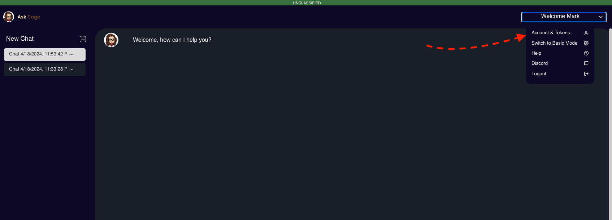
</p>

> Scroll down to the 'API Keys' section and click on the 'Generate API Key' button.
> 
> Create a new API Key by selecting the 'Create a new API Key' button. Provide a unique name for the API Key and click on the 'Submit' button. 
> 
> The API Key will be generated and displayed on the screen. Copy the API Key and store it in a secure location.

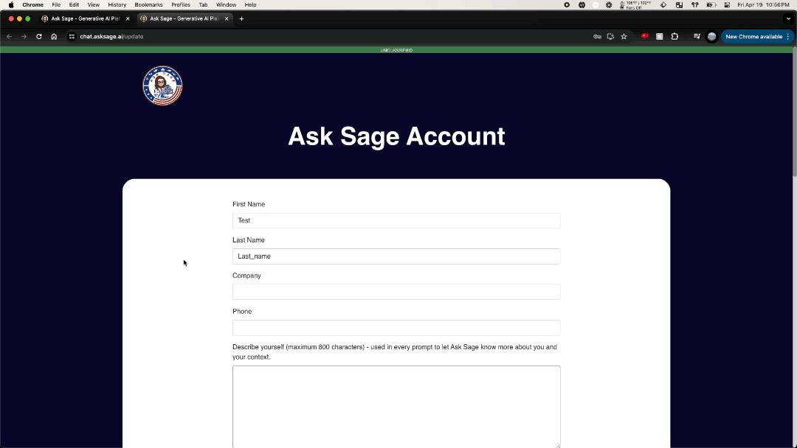

### API Authentication Set Up 

There are three methods to which a user can authenticate with the Ask Sage Endpoints:

 <center> 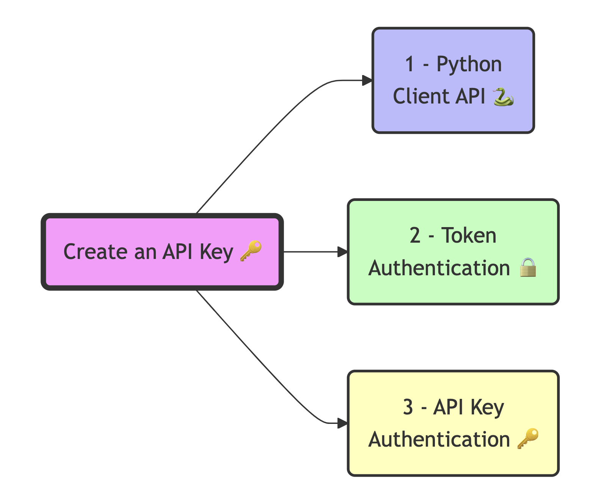 </center>

 ----------------------------

 #### 1. Ask Sage Python API Client 

The API key and email can be used to authenticate the user and grant access via the Ask Sage Python Client. The API key and user email will be included in the request headers.

For example, the following code snippet demonstrates how to create an instance of the AskSageClient class and authenticate with the Ask Sage API using the API key and email:
 
```python

import json # Import the json module to work with JSON data
import requests # Import the requests library to send HTTP requests
from asksageclient import AskSageClient # Import the AskSageClient class from the asksageclient module

# Function to load credentials from a JSON file
def load_credentials(filename):
    try:
        with open(filename) as file:
            return json.load(file)
    except FileNotFoundError:
        raise FileNotFoundError("The credentials file was not found.")
    except json.JSONDecodeError:
        raise ValueError("Failed to decode JSON from the credentials file.")

# Load the credentials
credentials = load_credentials('../../credentials.json')

# Extract the API key, and email from the credentials to be used in the API request
api_key = credentials['credentials']['api_key']
email = credentials['credentials']['Ask_sage_user_info']['username']

"""  
class AskSageClient(
    email: email, # The email address of the user
    api_key: api_key, # The API key for the Ask Sage API, which can be obtained from the Ask Sage website
    user_base_url: str = 'https://api.asksage.ai/user', # The base URL for the user API
    server_base_url: str = 'https://api.asksage.ai/server' # The base URL for the server API
)
"""

ask_sage_client = AskSageClient(email, api_key) # Create an instance of the AskSageClient class with the email and api_key 

```

Following this setup the user can now interact with the Ask Sage API using the AskSageClient object. 


#### 2. 24 Hour - Access Token

An access token is generated using the API key and email address with the endpoint '/get-token-with-api-key'. The access token is valid for 24 hours and can be used to authenticate requests to the Ask Sage API.

This is a more secure method of authentication as the access token is only valid for a limited time and must be regenerated periodically.

Here is a sample code snippet in Python that demonstrates how to obtain an access token using your email address and API key: 


```python
import requests

# Define the endpoint URL
url = "https://api.asksage.ai/user/get-token-with-api-key"

# Define the payload with the user's email and API key
payload = {
    "email": "your_email@your_domain.com",
    "api_key": "sdfsdfsfr23456789" # Your API key generated from the Ask Sage platform
}

# Set the headers, if required (e.g., Content-Type)
headers = {
    "Content-Type": "application/json"
}

# Make the POST request
response = requests.post(url, json=payload, headers=headers)

# Check if the request was successful
if response.status_code == 200:
    # Parse the JSON response
    data = response.json()
    # raw response
    print(data)
    # Extract the access token only from the response
    access_token = data['response']['access_token']
    print(access_token)
```

The generated access token can be used to authenticate requests to the Ask Sage API for the next 24 hours. Here is an example of how to use the access token to authenticate a request to any of the Ask Sage API endpoints:

```python

import requests

# Define the access token obtained from the previous request - Note: You would want to store this securely and not hardcode it in your script/file.
access_token = "fghjkl4567890" # Replace with the actual access token

# Define the endpoint URL
url = "https://api.asksage.ai/user/get-user-logins"  # Replace with the actual base URL of the API

# Define the payload with the limit parameter
payload = {
    "limit": 1  # Replace with the desired limit (max is 100)
}

# Set the headers, including the Authorization header with the Bearer token
headers = {
    "x-access-tokens": access_token,
    "Content-Type": "application/json"
}

# Make the POST request
response = requests.post(url, json=payload, headers=headers)

# Check if the request was successful
if response.status_code == 200:
    # Parse the JSON response
    data = response.json()
    print("User Logins:", data)
else:
    print(f"Failed to get user logins. Status code: {response.status_code}")
    print(f"Response: {response.text}")
```

#### 3. Static API Key
Instead of generating an access token every time you need to access the API, you can pass the static API key where the token is expected. This is not as secure as generating a 24 hour access token, but it is a valid option for some use cases.

> Note: The expected header variable is `x-access-tokens` and the value is the API key. There is no time limit on the API key, but it is recommended to regenerate it periodically for security reasons.

```python
import requests

# Define the access token obtained from the previous request - Note: You would want to store this securely and not hardcode it in your script/file.
access_token = api_key # 

# Define the endpoint URL
url = "https://api.asksage.ai/user/get-user-logins"  # Replace with the actual base URL of the API

# Define the payload with the limit parameter
payload = {
    "limit": 1  # Replace with the desired limit (max is 100)
}

# Set the headers, including the Authorization header with the Bearer token
headers = {
    "x-access-tokens": access_token,
    "Content-Type": "application/json"
}

# Make the POST request
response = requests.post(url, json=payload, headers=headers)

# Check if the request was successful
if response.status_code == 200:
    # Parse the JSON response
    data = response.json()
    print("User Logins:", data)
else:
    print(f"Failed to get user logins. Status code: {response.status_code}")
    print(f"Response: {response.text}")
```

--------------------------------

### Examples 

These examples will be more focused on how one can interact with the Ask Sage API and what to expect in the response. Additionally, some mini projects will be created to demonstrate the capabilities of Generative AI and how it can be used in real-world scenarios. Although this repository is focused on the Ask Sage API, the examples will be general enough to be applied to other platforms that provide similar services but may have different endpoints or parameters.

Note: The examples at the moment are more focused on text-based models but will be expanded to the interaction of LLM's with other data types like images, audio, and video (multi-modal models). Going into those examples will lead to more complex projects and will require more resources and time to complete.

After installing packages from `requirements.txt`, you may need to restart your Jupyter kernel to use the updated packages. This ensures that the newly installed libraries are loaded correctly.
 
#### 0. AI Ethics 

✅ Done ✅ 

This is not really an example but more of a discussion on the ethical implications of using AI and how to mitigate any potential risks. We place a strong emphasis that a user needs to be well trained on how AI works, but also provide a clear understanding that what is generated through GenAI tools may not always be correct. 

- To go to this sections overview [](examples/ex_0_ai_ethics/AI-Ethics.md)


<p align="center">
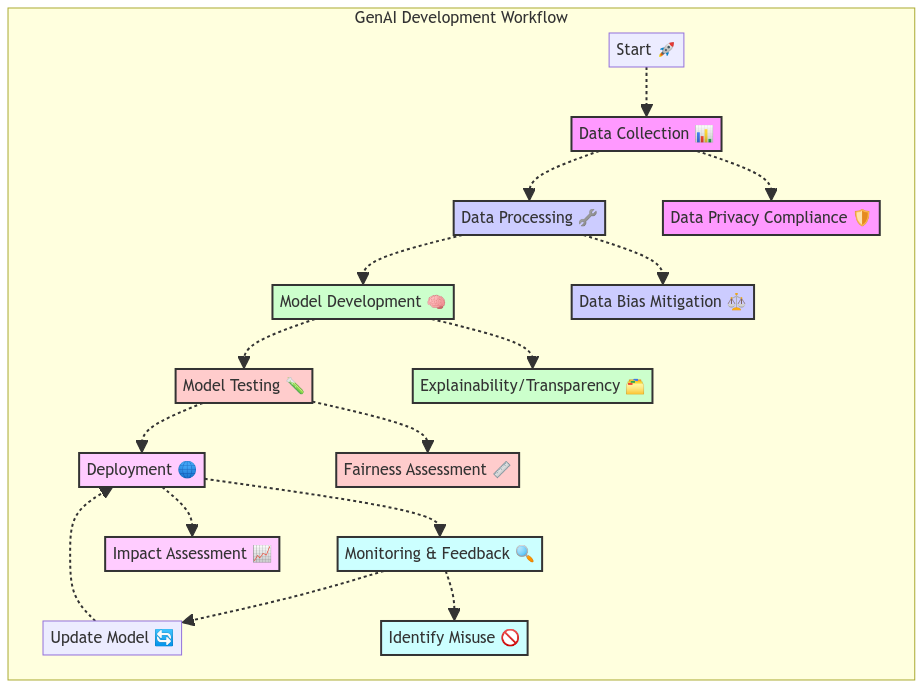
</p>

#### 1. API Endpoints

✅ Done ✅ 

This example will cover how to use the Ask Sage API endpoints and what to expect in the responses at a high level. The follow on examples will show how the endpoints can be used in a real-world scenarios to create useful applications, tools, or services. 

- Ask Sage API Endpoints Overview [](examples/ex_1_api_endpoints/AskSage_API_Endpoints.md)
- Ask Sage API Code Examples [](examples/ex_1_api_endpoints/asksage_python_client_overview.ipynb)


<p align="center">
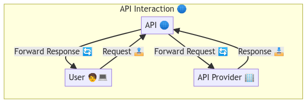
</p>

#### 2. Prompt Engineering

🚧 In Construction 🚧 --> Full Release Coming Soon!

This example will cover how to interact with a LLM model and how to use prompt engineering to generate high-quality text to be used to guide the model in generating the desired output. Prompt engineering is a powerful and necessary skill that can be used to control the output of a language model and generate text that meets specific criteria or requirements. 

- Prompt Engineering Overview [](examples/ex_2_prompt_engineering/prompt_engineering_overview.md)  
- Example A: [Prompt Engineering For Code Generation](examples/ex_2_prompt_engineering/Prompt_Engineering_For_Code_Generation.ipynb)
- Example B: [Prompt Engineering For Grant Writing](examples/ex_2_prompt_engineering/Prompt_Engineering_For_Grant_Writing.ipynb)
- Example C: [Prompt Engineering For Writing A Speech](examples/ex_2_prompt_engineering/Prompt_Engineering_For_Writing_A_Speech.ipynb)
- Example D: [Prompt Engineering For Recipe Generation](examples/ex_2_prompt_engineering/Prompt_Engineering_For_Recipe_Generation.ipynb)
- Example E: [Prompt Engineering For Project Management](examples/ex_2_prompt_engineering/Prompt_Engineering_For_Project_Management.ipynb)
- Example F: [Prompt Engineering - Detailed Explanation On Underlying Concepts and Techniques](examples/ex_2_prompt_engineering/Prompt_Engineering_Detailed_Explanation.ipynb)
- Example G: [Prompt Engineering - Chatbot Creation](examples/ex_2_prompt_engineering/Prompt_Engineering_Chatbot_Creation.ipynb)

<p align="center">

</p>

#### 3. Custom Dataset

🚧 In Construction 🚧 

For the most part, LLM models are trained on large datasets that contain a wide range of text from various sources and are not guaranteed to be relevant to the user's specific needs. However, on Ask Sage, users can create custom datasets that contain text that is relevant to their domain or use case and use it with methods like Retrieval-Augmented Generation (RAG) to improve the performance of the model. Thus, this example will cover how to create a custom dataset and use it with a LLM model to generate text that is more relevant to the user's needs. More detailed information will be provided within the example on how the model works/integrates with the dataset.

- To go to this section click [LLM Dataset](examples/ex_3_llm_dataset/LLM_Dataset.md)
- Example A: [Basic Overview of Building a LLM Dataset](examples/ex_3_llm_dataset/Creating_A_Custom_Dataset.ipynb)

<p align="center">
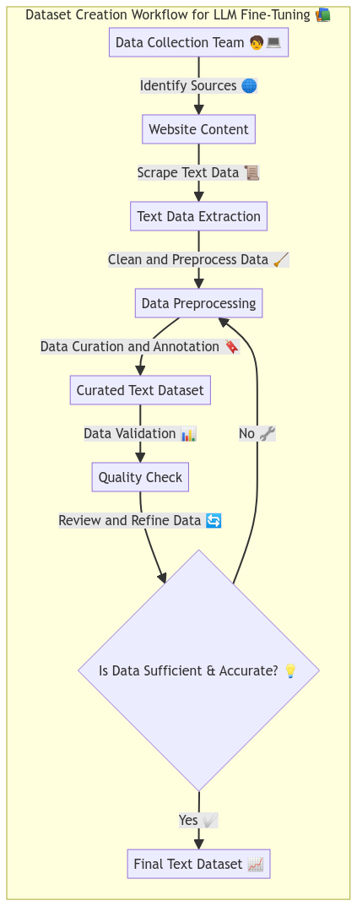
</p>

#### 4. Comparing LLM Models

🚧 In Construction 🚧 

The number of LLM models available in today is vast and will continue to grow as more research is done in the field of generative AI. This example will cover how to compare different LLM models using Ask Sage agnostic API method, and evaluate their performance based on various criteria such as text quality, coherence, creativity, and more. Users can use this information to select the best model for their needs and make informed decisions about which model to use in their projects.

To go to this section click [Comparing LLM Models](examples/ex_4_comparing_llm_models/Comparing_LLM_Models.md)

<p align="center">
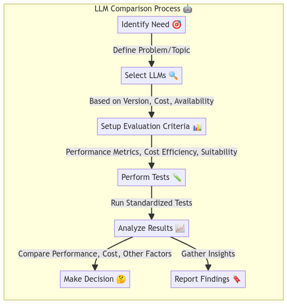
</p>

#### 5. Diagram Creation With LLMs

🚧 In Construction 🚧 

This is a unique project and will probably be outdated in the future but, LLMs are text-based models that generate text based on the input provided by the user, but what if we wanted to generate a diagram without having to manually create it? For example let's say we wanted a flowchart, mind map, Gantt chart, or any other type of diagram. This example will cover how we use mermaid.js a text-based diagram creation tool to generate diagrams based on the text generated by the LLM model. 

To go to this section click [Diagram Creation With LLMs](examples/ex_5_diagram_creation_with_llms/Diagram_Creation_With_LLMs.md)

<p align="center">
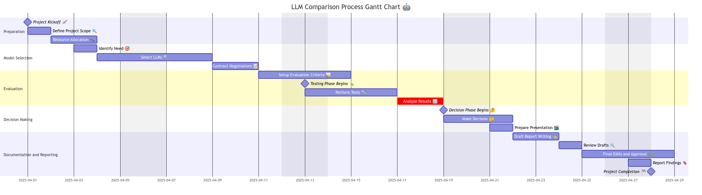
</p>

<p align="center">

</p>

<p align="center">
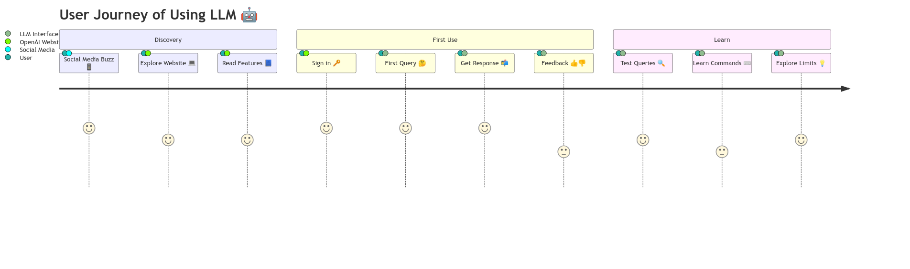
</p>

<p align="center">
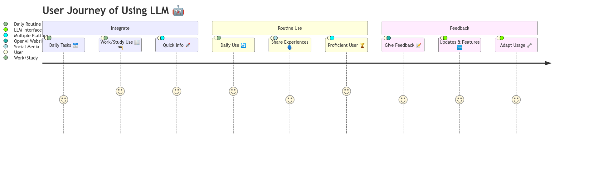
</p>

#### 6. LLM Deployment On A Edge Device

🚧 In Construction 🚧 

What about being able to deploy a LLM model on a edge device like a Raspberry Pi or Jetson Nano? This example will cover how to deploy a LLM model on a edge device and generate text utilizing the Ask Sage API. 

To go to this section click [LLM Deployment On A Edge Device](examples/ex_6_llm_deployment_edge_device/LLM_Deployment_On_A_Edge_Device.md)

<p align="center">
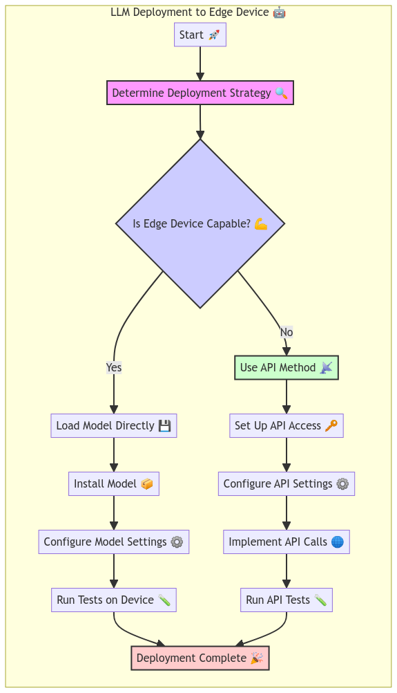
</p>

#### 7. LLM Evaluation and Monitoring Dashboard

🚧 In Construction 🚧 

How do we evaluate the performance of a LLM model and monitor its progress over time? This example will cover how to create a dashboard that displays key metrics and insights about the LLM model. Users can use this dashboard to track the performance of the model and make informed decisions about how to improve it over time.

But first, we will use @arize-ai phoenix open source tool to create a dashboard that displays key metrics and insights about the LLM model.

- To go to this section click [LLM Evaluation and Monitoring Dashboard](examples/ex_7_llm_evaluation_monitoring_dashboard/LLM_Evaluation_And_Monitoring_Dashboard.md)
- Example A: [Phoenix - Tracing with LlamaIndex](examples/ex_7_llm_evaluation_monitoring_dashboard/Phoenix_Tracing_With_LlamaIndex.ipynb)
- Example B: [Phoenix - Model Evaluation with LangChain](examples/ex_7_llm_evaluation_monitoring_dashboard/Phoenix_Model_Evaluation_With_LangChain.ipynb)
- Example C: [Phoenix - LLM Evals](examples/ex_7_llm_evaluation_monitoring_dashboard/Phoenix_LLM_Evals.ipynb)
- Example D: [Phoenix - Embedding Analysis](examples/ex_7_llm_evaluation_monitoring_dashboard/Phoenix_Embedding_Analysis.ipynb)
- Example E: [Phoenix - UMAP-based Exploratory Data Analysis](examples/ex_7_llm_evaluation_monitoring_dashboard/Phoenix_UMAP_Based_Exploratory_Data_Analysis.ipynb)
- Example F: [Phoenix - Exportable Clusters](examples/ex_7_llm_evaluation_monitoring_dashboard/Phoenix_Exportable_Clusters.ipynb)

<p align="center">
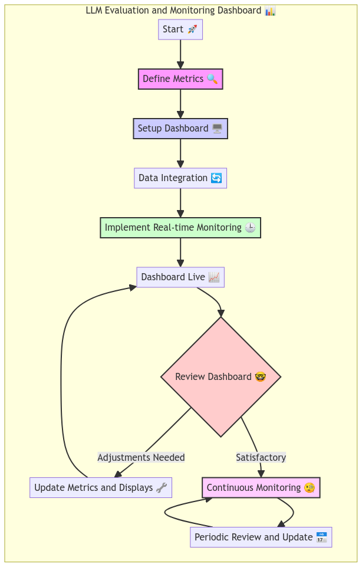

#### 8. LLM Chatbot Network
🚧 In Construction 🚧 

Let's create a network of chatbots that can communicate with each other and generate text based on each other's output. This example will cover how to create a chatbot network using LLM models and simulate a conversation between the chatbots. Users can use this network to generate creative and engaging text that can be used in a variety of applications, scenarios, and modeling use cases.

To go to this section click [LLM Chatbot Network](examples/ex_8_llm_chatbot_network/LLM_Chatbot_Network.md)

<p align="center">
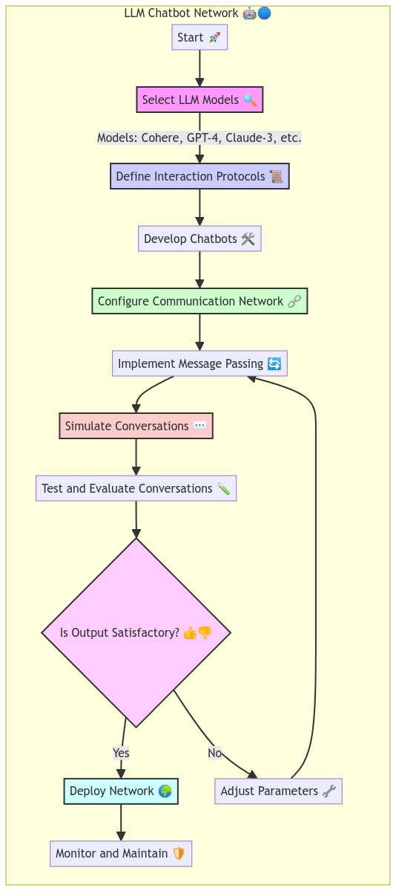
</p>

### 9. Additional Requested Examples 
Here we are providing a list of additional examples that originate from users asking for specific examples or use cases. If you have a specific example or use case you would like to see, please reach out to us and we will do our best to create an example that meets your needs. The best way to reach out to us is by joining our discord server and posting your request there [Discord - Ask Sage 💬](https://discord.gg/upxuAdNvjY):

- Example 01: Leveraging a LLM to write a description of photos provided by a user. [](examples/ex_9_additional_requested_examples/ex_1_llm_interpretation_description.ipynb)


### Error Handling 
The AskSage API may return errors in certain situations, such as when an invalid request is made or when the rate limit is exceeded. Users should be familiar with the error codes and messages returned by the API and handle them appropriately in their code.

- How to use a LLM to 

### Best Practices 
Here are some best practices to keep in mind when working with the Ask Sage API:

- Keep your API key and access token secure and do not share them with others.
- Be aware of the rate limits imposed by the API and adjust your usage accordingly.
- Handle errors returned by the API gracefully and report them to Ask Sage if necessary.
- Follow the API documentation and guidelines provided by Ask Sage to ensure that your requests are formatted correctly.
- Test your code thoroughly before deploying it to ensure that it works as expected.
- Monitor your usage of the API and adjust your usage if necessary to avoid overages or rate limiting.
- Provide feedback to Ask Sage on the API and any issues or suggestions you may have for improvement.
- Stay up to date on changes to the API and any new features or endpoints that may be added in the future.
- Document your code and keep track of any changes or updates you make to it over time.
- Share your code and experiences with the Ask Sage community to help others learn and improve their own projects. (Please 🥹)
- Have fun and be creative with your use of the API to explore new possibilities and applications for generative AI.

## Other Resources Related to GenerativeAI (GenAI)
We will provide additional pdf documents that will contain resources related to GenerativeAI (GenAI). This document will include links to articles, books, tutorials, videos, and other content that may be helpful for users who are interested in learning more about generative AI and how to use it effectively.

Our goal is to provide a comprehensive list of resources that cover a wide range of topics related to generative AI, including natural language processing, computer vision, reinforcement learning, and more. We will also include resources that cover specific models and tools that are commonly used in the field of generative AI.

If you have any suggestions for resources to include in this document, please feel free to reach out to us and we will do my best to add them to the list.

Happy learning! 📚🧠🚀

## Definitions To Know 
We will be providing a list of vocabulary that are important to know when working with Generative AI or Machine Learning. These terms will help users understand the terminology used in the field of AI/Machine Learning and how to apply it in their projects.

For example here are some terms to know when working with Generative AI:

- Generative AI
- Large Language Model
- RESTful Interface
- API (Application Programming Interface)
- JSON Format
- Rate Limiting
- Error Handling
- Tokenization
- Authentication
- Versioning
- Data Ingestion
- Vector Embedding
- Prompt Engineering
- Fine-Tuning
- Multi-Modal
- Edge Device

To view the full list of definitions click [Defintions To Know](study_materials/AI_ML_Vocabulary.md)

## Video 
- Link to YouTube Videos going through this repository (WILL BE ADDED LATER 🚧)

## Requested Features or Enhancements to Ask Sage API
Here are some features or enhancements that we would like to see added to the Ask Sage API: 

Each item will have a link to the example that will be created to demonstrate where the feature or enhancement can be used.

### Issues
- Uploading data works and one is able to get a 'successful' response but only .docx and .pdf files are actually being processed and visible on the platform. [API Endpoints](examples/ex_1_api_endpoints)
- When utilizing the query endpoint, the model parameter should not work if the model entered does not exist. Currently, any text can be entered and the API will return a response using the default model. [API Endpoints](examples/ex_1_api_endpoints)
- When selecting a persona, the API should return an error if the persona entered does not exist. Currently, any text can be entered and the API will return a response using the default persona. This can be problematic if a user misspells the persona name, a persona is removed and if the user enters a persona that is not available or does not exist. [API Endpoints](examples/ex_1_api_endpoints)
- When utilizing the train endpoint, the instruction mention to use the following format: user_content_USERID_DATASET-NAME_content. However, the dataset is not being recognized when using the format provided. Just used the dataset name and it worked. [API Endpoints](examples/ex_1_api_endpoints)
  - Also would the uploaded content be visible on the platform? At the moment it is not visible.

### Enhancements
- For the /get_user_logs endpoint, add a parameter to specify the number of logs to return if a user wants to only get a specific number of logs. Additionally, can add a parameter to specify ascending or descending order of the logs. (Maybe a date filter parameter) [API Endpoints](examples/ex_1_api_endpoints)
- An endpoint that allows to select a database that a user created and then see all the content that was added to the database and being able to delete it. [API Endpoints](examples/ex_1_api_endpoints)

## Bugs or Issues 
Any bugs or issues found in the Ask Sage API should be reported to the Ask Sage team directly. If you encounter any problems with the API, please reach out to the Ask Sage team for assistance. Additionally, you can report bugs or issues in this repository and we will test and verify them before forwarding them to the Ask Sage team.

## License
This repository is licensed under the MIT License. See the [LICENSE](LICENSE.md) file for more information.

## Sources
- https://github.com/jessesquires/.github - Thank you jessequires for the templats on the various files in the repository. 
- https://www.ibm.com/docs/en/watson-studio-local/1.2.3?topic=notebooks-markdown-jupyter-cheatsheet 

## Tools Used
- [Mermaid.js](https://mermaid-js.github.io/mermaid/#/)
- [Swagger](https://swagger.io/)

[def]: #asksage-api-