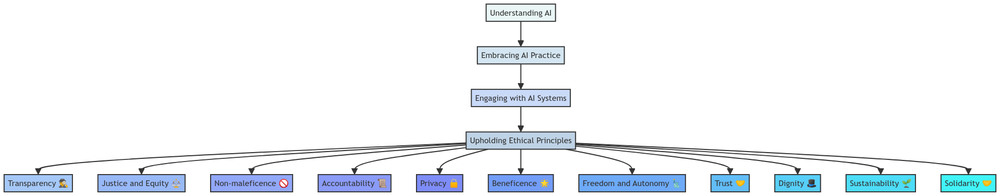

# AI - Ethics 

This is written by Mark Espinoza, and the information is an opinion that is not associated with any organization, and is not intended to be used as a reference for any organization. 

## Short Statement: 

###  Be A Practitioner of AI 
**This section is dedicated to inspiring individuals to embrace AI systems, urging them not to shy away or dismiss AI until they have at least a basic understanding of its functionality.** With AI systems increasingly integrating into our daily lives, it's important that individuals equip themselves with the knowledge and skills necessary to navigate this dynamic AI landscape. Through active engagement with AI systems, individuals can cultivate a deeper understanding of their capabilities and limitations, empowering them to make informed decisions regarding their utilization.

Despite valid concerns about privacy, security, and ethical implications surrounding AI, it's crucial to acknowledge that responsible AI usage hinges on active engagement and participation in the ongoing discourse surrounding AI. By immersing themselves in AI systems, individuals can actively contribute to the development of ethical best practices that prioritize transparency, accountability, and fairness in AI deployment.

Therefore, I advocate for embracing the role of an AI practitioner and actively engaging with AI systems in a manner that upholds both responsibility and ethics. This involves understanding the capabilities and limitations of AI systems, being transparent about their utilization, and ensuring that AI systems are not used to perpetuate harm or discrimination. Additionally, it entails using AI systems in a fair and equitable manner while remaining mindful of the privacy and security implications they may entail.

-----

## Other Resources

We are not associated with any of the following resources, but we believe they may be helpful to you in reference to AI ethics and safety.

If you are interested in learning more about AI ethics, here are some additional resources that you may find helpful:
- AI Ethics: What It Is and Why It Matters [Article](https://www.coursera.org/articles/ai-ethics)
- The Ethics of AI Ethics: An Evaluation of Guidelines [Article](https://link.springer.com/article/10.1007/S11023-020-09517-8)
- Worldwide AI ethics: A review of 200 guidelines and recommendations for AI governance [Article](https://www.ncbi.nlm.nih.gov/pmc/articles/PMC10591196/)