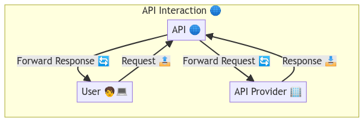

# ASkSage API Python Client Endpoints

## Introduction
This first example is just a high-level overview of interfacing with the AskSage Python client. The AskSage API is a powerful tool that allows you to interact with the AskSage service programmatically. This can be useful for automating tasks, integrating AskSage into your own applications, or simply exploring the capabilities of the service.

More detailed examples will be provided in subsequent examples and tutorials, which will also inclide real-world use cases and examples.

## API Endpoints

Note these are the ones available in the Python client as of the time of writing. 

|       Function Name         |                       Description                     |
|:---------------------------:|:-----------------------------------------------------:|
|       `add_dataset`         |                   Adds a new dataset                  |
|     `delete_dataset`        |              Deletes a specified dataset              |
|     `assign_dataset`        |                   Assigns a dataset                   |
|     `get_user_logs`         |             Retrieves all logs for user               |
|    `get_user_logins`        | Retrieves login information for a specific user       |
|          `query`            | Interact with the /query endpoint of the Ask Sage API |
|    `query_with_file`        |         Executes a query using a file                 |
|      `query_plugin`         | Executes a query using a specific plugin              |
| `follow_up_questions`       | Interact with the /follow-up-questions endpoint of the Ask Sage API |
|        `tokenizer`          | Interact with the /tokenizer endpoint of the Ask Sage API |
|      `get_personas`         | Get the available personas from the Ask Sage service  |
|      `get_datasets`         | Get the available datasets from the Ask Sage service  |
|       `get_plugins`         | Get the available plugins from the Ask Sage service   |
|  `count_monthly_tokens`     | Get the count of monthly training tokens spent for this user from the Ask Sage service |
|`count_monthly_teach_tokens` | Counts the number of teach tokens used in a month     |
|          `train`            | Train the model based on the provided content         |
|    `train_with_file`        | Train the dataset based on the provided file          |
|          `file`             | Upload a file to the Ask Sage service                 |

## Leave a Comment
If you have any questions or comments, please feel free to let us know. We would love to hear from you!

Happy coding! 🚀