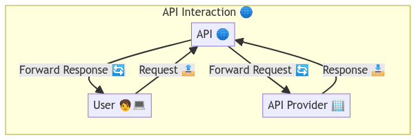

# Ask Sage API Endpoints

## API Endpoints Overview

The Ask Sage API is documented using Swagger, which provides detailed information about the available endpoints, request parameters, response formats, and authentication methods.

### User API:
- Documentation: https://app.swaggerhub.com/apis-docs/AskSage/user-api/1.0
- The Base URL for the User API is: [ Base URL: https://api.asksage.ai/user/]

> The following table shows the available endpoints in the User API:

| Method | Endpoint | Description |
|:---:|:---:|:---:|
| POST | /get-token-with-api-key | Get an access token with API Key and email |
| POST | /get-user-logins | Get your last logins (limited to 5 by default) |
| POST | /get-user-logs | Get your last prompts |
| POST | /add-dataset | Add a new dataset |
| POST | /delete-datasets | Delete a dataset |
| POST | /get-chats | Get all chat sessions for user |
| POST | /get-chat-session | Get specific chat session |
| POST | /delete-chat-session | Delete chat session |
| POST | /deassign-dataset | Remove dataset from user |
| POST | /update-permission-dataset | Update dataset permissions |
| POST | /get-datasets-with-permissions | Get user datasets with permissions |
| POST | /get-user-api-keys | Get user API keys |
| POST | /user-api-key | Create new API key |
| DELETE | /user-api-key | Delete API key |

Append the Base URL with the endpoint to interact with the Ask Sage API. Example https://api.asksage.ai/user/add-dataset

### Server API: 
- Documentation: https://app.swaggerhub.com/apis-docs/AskSage/server_ask-sage_api/1.0
- The Base URL for the Server API is: [ Base URL: https://api.asksage.ai/server/]

This information is used to interact with the Ask Sage API. The user can query models, select/get personas, get datasets, train models and more. 

> The following table shows the available endpoints in the Server API:

| Method | Endpoint | Description |
|:---:|:---:|:---:|
| POST | /get-models | Returns a list of available models |
| POST | /query | Main endpoint for generating completions based on the user's input |
| POST | /query_with_file | Query with file for generating completions based on the user's input |
| POST | /query-plugin | Query with plugin for generating completions based on the user's input |
| POST | /execute-plugin | Execute a plugin with the provided content |
| POST | /execute-plugin-with-file | Execute plugin with file input |
| POST | /follow_up_questions | Endpoint for generating follow-up questions based on the user's input |
| POST | /tokenizer | Endpoint for getting tokens of string value |
| POST | /get-personas | Get available personas |
| POST | /get-datasets | Returns a list of available datasets |
| POST | /get-plugins | Returns a list of available plugins |
| POST | /train | Train the model based on the user's input |
| POST | /train-with-file | Train model using file content |
| POST | /train-with-array | Train model using array of content |
| POST | /file | Convert supported file to plain text |
| POST | /get-deep-agent | Get streaming updates from deep agent |
| POST | /add-mcp-server | Add new MCP server for user |
| PUT | /update-mcp-server | Update existing MCP server configuration |
| GET | /list-mcp-servers | Get list of all MCP servers for user |
| POST | /list-mcp-servers | Get list of all MCP servers for user |
| GET | /list-mcp-whitelisted-servers | Get list of whitelisted MCP servers |
| GET | /list-mcp-tools | Get list of available MCP tools |
| DELETE | /delete-mcp-server | Soft delete MCP server |
| DELETE | /dataset | Delete specific dataset |
| POST | /delete-filename-from-dataset | Remove specific file from dataset |
| POST | /get-all-files-ingested | Returns list of all ingested files |
| POST | /copy-files-dataset | Copy files from one dataset to another |
| POST | /vote-down | Mark response as unhelpful or incorrect |
| GET | /count-monthly-tokens | Returns count of tokens used this month |
| POST | /count-monthly-tokens | Returns token count for specific app |
| GET | /count-monthly-teach-tokens | Returns training tokens used this month |
| GET | /get-secrets | Returns list of stored secrets (keys only) |
| POST | /get-text-to-speech | Generate audio from text using TTS |
| GET | /list-agents | Returns a list of all agents available to user |
| POST | /execute-agent | Execute an agent with a message and optional variables |

Append the Base URL with the endpoint to interact with the Ask Sage API. Example https://api.asksage.ai/server/get-models

##  Ask Sage Python Client Endpoints

The Ask Sage Python client is documented and managed via the following link Python API Client: https://pypi.org/project/asksageclient/

###  API Endpoints

Note these are the ones available in the Python client as of the time of writing. 

| Function Name               | Description                                                          |
|-----------------------------|----------------------------------------------------------------------|
| `get_models`                | Get the available models from the Ask Sage service.                  |
| `add_dataset`               | Adds a new dataset                                                   |
| `delete_dataset`            | Deletes a specified dataset                                          |
| `assign_dataset`            | Assigns a dataset                                                    |
| `get_user_logs`             | Retrieves all logs for user                                          |
| `get_user_logins`           | Retrieves login information for a specific user                      |
| `query`                     | Interact with the /query endpoint of the Ask Sage API.               |
| `query_plugin`              | Executes a query using a specific plugin                             |
| `execute_plugin`            | Executes a plugin with the provided content                          |
| `follow_up_questions`       | Interact with the /follow-up-questions endpoint of the Ask Sage API. |
| `tokenizer`                 | Interact with the /tokenizer endpoint of the Ask Sage API.           |
| `get_personas`              | Get the available personas from the Ask Sage service.                |
| `get_datasets`              | Get the available datasets from the Ask Sage service.                |
| `get_plugins`               | Get the available plugins from the Ask Sage service.                 |
| `count_monthly_tokens`      | Get the count of monthly tokens spent for this user.                 |
| `count_monthly_teach_tokens`| Counts the number of teach tokens used in a month                    |
| `train`                     | Train the model based on the provided content.                       |
| `train_with_file`           | Train the dataset based on the provided file.                        |
| `file`                      | Upload a file to the Ask Sage service.                               |

Get Started and Navigate to the jupyter notebook example going through all the endpoints   

## Leave a Comment
If you have any questions or comments, please feel free to let us know. We would love to hear from you!

Happy coding! 🚀