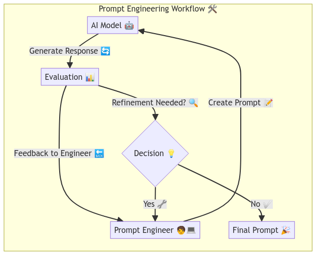

# Prompt Engineering Overview: 

👋 Hello, and welcome to the Prompt Engineering Overview! In this section, we're going to dive into the fascinating world of Prompt Engineering. 🌍

We'll discuss what Prompt Engineering is, why it's crucial, how to do it, common pitfalls, the process, and best practices. We'll also touch on the tools you can use for prompt engineering. 🛠️

We'll briefly talk about evaluation metrics and datasets for prompt engineering at a high level, but we'll delve deeper into these topics in the upcoming sections. For now, our spotlight is solely on Prompt Engineering. 🎯

Why start with Prompt Engineering, you ask? Well, we believe it's a fantastic launchpad that yields immediate, impressive results, sparking your curiosity to learn more about the underlying models and techniques. 🚀

So, are you ready to embark on this journey? Let's get started! 🎉

Note: This overview is designed to provide a high-level understanding of Prompt Engineering. For more in-depth information, review the subsequent examples and references provided in the following sections.

## Table of Contents
- [Prompt Engineering Overview:](#prompt-engineering-overview)
  - [Table of Contents](#table-of-contents)
  - [General Overview of Generative Artificial Intelligence (Specifically LLMs)](#general-overview-of-generative-artificial-intelligence-specifically-llms)
  - [What is Prompt Engineering?](#what-is-prompt-engineering)
  - [Why is Prompt Engineering Important?](#why-is-prompt-engineering-important)
  - [What are the common mistakes in Prompt Engineering?](#what-are-the-common-mistakes-in-prompt-engineering)
    - [Mistake 1: Using LLMs without proper understanding or guidance.](#mistake-1-using-llms-without-proper-understanding-or-guidance)
    - [Mistake 1: Misjudging the Autonomy of LLMs and the Importance of Skilled Prompting](#mistake-1-misjudging-the-autonomy-of-llms-and-the-importance-of-skilled-prompting)
    - [Mistake 2: Selecting the wrong model for the task](#mistake-2-selecting-the-wrong-model-for-the-task)
    - [Mistake 3: Not understanding the limitations of the model](#mistake-3-not-understanding-the-limitations-of-the-model)
    - [Mistake 4: Security and Privacy Concerns](#mistake-4-security-and-privacy-concerns)
  - [What are the best practices for Prompt Engineering?](#what-are-the-best-practices-for-prompt-engineering)
    - [Technique 1: Selecting the right model](#technique-1-selecting-the-right-model)
    - [Technique 2: How to write a good prompt?](#technique-2-how-to-write-a-good-prompt)
      - [Zero-shot learning](#zero-shot-learning)
      - [One-shot learning](#one-shot-learning)
      - [Few-shot learning](#few-shot-learning)
    - [Technique 3: Model Hyperparameters (i.e., temperature, max tokens, etc.)](#technique-3-model-hyperparameters-ie-temperature-max-tokens-etc)
      - [Temperature](#temperature)
      - [Max tokens](#max-tokens)
      - [dataset](#dataset)
      - [References](#references)
      - [Persona](#persona)
      - [Live/Live+](#livelive)
      - [System Prompt](#system-prompt)
    - [Technique 4: Chaining Prompts - How to chain prompts?](#technique-4-chaining-prompts---how-to-chain-prompts)
    - [Technique 5: Human in the Loop (HITL)](#technique-5-human-in-the-loop-hitl)
    - [Technique 6: Evaluate Results](#technique-6-evaluate-results)
  - [Conclusion:](#conclusion)
  - [Key Terms:](#key-terms)
  - [External Resources:](#external-resources)

## General Overview of Generative Artificial Intelligence (Specifically LLMs)

Before we dive into the intricacies of Prompt Engineering, it's crucial to lay the groundwork with a solid understanding of GenAI and the role of LLMs within this space.

GenAI stands at the forefront of AI innovation, with models that are adept at creating new content—be it text, images, or audio—mirroring the nuances of human creativity. These models are trained on diverse datasets and are capable of applications that span from crafting written narratives to synthesizing realistic images and generating speech.

LLMs, a subset of GenAI, are particularly fascinating due to their ability to process and produce text that closely resembles human writing. These models are the result of training on vast corpora of text data, fine-tuning billions of parameters to capture the subtleties of language. Their prowess is evident in tasks such as completing text, summarizing large documents, and translating between languages with a finesse that approaches human translators.

Parameters in LLMs are akin to the synapses in the human brain—they are the learned weights that determine the model's output, shaping the text it generates. The more parameters a model has, the more nuanced and sophisticated its capabilities. However, this complexity comes at a cost, requiring significant computational power to both train and operate.

Foundation or Base models of LLMs serve as the starting blocks, offering robust text generation across a spectrum of tasks. Yet, they may not always be fine-tuned for niche domains or specialized tasks due to limitations in training data. Despite this, they showcase remarkable adaptability through few-shot learning, where they can grasp and perform tasks with minimal examples, even those they were not explicitly trained for.

Fine-tuning LLMs is a transformative process, where models are further trained on targeted datasets to excel in specific domains. This process allows the models to internalize domain-specific patterns, enhancing their performance and making them invaluable tools for specialized applications.

The power of LLMs, however, is fully realized through the art of prompt engineering—the strategic crafting of input prompts to elicit the desired output. This process is not merely about instructing the model but involves a nuanced design of prompts that align with the model's learning and output generation patterns. Effective prompt engineering is the key to unlocking the full potential of LLMs, ensuring outputs that are not only accurate but also contextually relevant.

As we proceed, we will delve deeper into prompt engineering, exploring its significance, the methodologies for crafting effective prompts, the pitfalls to avoid, and the tools that can aid in this process. Mastering prompt engineering empowers you to harness the vast capabilities of LLMs, paving the way for cutting-edge solutions in generative AI.

## What is Prompt Engineering? 

Which of these questions is better and how would you respond to them if a stranger asked you on the street?

----

1. "How did you do that?" 

2. "Wow, you just made an amazing painting showing a beautiful sunset. Can you tell me more about your inspiration and the techniques you used to create it?"

----

The art of inquiry is a subtle yet powerful tool, and the second question is a prime example of its effective use. It's a well-crafted query that not only acknowledges the artist's work but also invites a rich narrative about the creative process. This question is superior because it's specific, showing genuine interest and prompting a detailed response. It's a clear demonstration of the principles of prompt engineering—formulating questions that elicit informative and meaningful answers.

If a stranger approached you with the first question, "How did you do that?" while you're on the street, the ambiguity of their query would likely prompt you to seek clarification. You might respond with, "Could you please specify what aspect of my work you're referring to?" This additional question helps to narrow down the focus, ensuring that your response is both relevant and informative.

Conversely, if someone posed the second question, it would immediately open the door to a rich dialogue. You could enthusiastically share the story behind the sunset in your painting, detailing the inspiration drawn from nature's splendor and discussing the techniques employed, such as the layering of oil pastels to achieve the vivid hues that bring the scene to life.

Prompt engineering, in essence, is about crafting a conversational compass—a guide that navigates the exchange of information towards clarity and depth. By designing thoughtful prompts, you pave the way for successful communication, whether it's a spontaneous street-side conversation or an interaction with a sophisticated AI system. Good prompts are the keystones of effective communication, setting the stage for responses that are not just answers, but insights.

So, asking the right questions isn't just about getting better answers—it's also about making conversations more engaging and productive. Whether you're talking to a person or a machine, the quality of your questions directly influences the quality of the information you receive. By mastering the art of prompt engineering, you can effectively guide interactions to uncover deeper insights and more meaningful exchanges. Remember, every great conversation starts with a great question.

## Why is Prompt Engineering Important?

Effective communication is the cornerstone of achieving desired outcomes in any interaction. It's a two-way street 🛣️ where clarity and understanding are paramount. Without it, we're left in a maze of confusion and frustration 😵‍💫.

Consider a doctor's visit 🩺. A physician's expertise is only as good as the questions they pose and the information they gather. Asking the right questions is crucial for an accurate diagnosis. A misstep here could lead to incorrect treatment. Similarly, patients must convey their symptoms accurately. Factors like the doctor's specialty, the patient's age (pediatric vs. adult care), the urgency of the situation (ER vs. a routine check-up), language barriers, and cultural nuances all influence this delicate dance of dialogue.

This is where the art of prompt engineering comes into play. Just like a doctor-patient interaction, engaging with a large language model requires crafting the right prompts to extract precise information. A vague or off-target question can lead to unhelpful responses, leaving you feeling as though the model is inadequate. But it's not the model's capability at fault—it's the communication.

Prompt engineering is the key 🔑 to unlocking the full potential of AI. It's about fine-tuning your questions to align with the AI's understanding. When done correctly, it's like having a conversation with a knowledgeable assistant, ready to provide the insights you seek.

In essence, mastering prompt engineering is about harnessing the power of AI to serve your needs effectively. It's the bridge 🌉 between human inquiry and machine intelligence, ensuring that the flow of information is not just continuous but also meaningful.

## What are the common mistakes in Prompt Engineering?

Before diving into the craft of creating effective prompts, it's important to shed light on the common mistakes people often make when interacting with LLMs. We're highlighting these not just to set realistic expectations, but also to offer a roadmap for avoiding these pitfalls and to acknowledge the limitations inherent in these models.

Understanding where others have gone wrong can help you sidestep these issues and enhance the quality of your exchanges with LLMs. Recognizing these errors also helps you grasp the critical role of prompt engineering in directing the behavior of these sophisticated tools.

### Mistake 1: Using LLMs without proper understanding or guidance. 

We often assume that LLMs can effortlessly generate accurate and relevant text without any guidance. However, these models require clear prompts to produce meaningful responses. Without proper understanding or guidance, LLMs have a high probability of generating irrelevant or inaccurate text, leading to subpar results. Therefore, our recommendation is to invest time in not only understanding the GenAI capabilities, but also in crafting effective prompts to guide the model.
Becoming proficient in interacting with LLMs will take about 1 - 2 months of consistent practice and learning depending on your background and familiarity with the field, but also your availability and dedication to the task.

At the moment of this writing, ChatGPT-4o is the most advanced model available, and it is capable of generating high-quality text across a wide range of tasks. However, it is essential to understand that even the most advanced models today have limitations and may not always produce the desired output without proper guidance.

Lastly, remember that models have a limit on the amount of data/tokens they can process at once. If you provide too much information in your prompt, the model won't register it until less data/tokens are provided. This is why it's important to keep your prompts concise and to the point.

### Mistake 1: Misjudging the Autonomy of LLMs and the Importance of Skilled Prompting

A common misconception is that LLMs like ChatGPT can autonomously generate precise and relevant content with minimal input. This belief underestimates the critical role of skilled prompting and overestimates the model's intuitive understanding of user intentions. LLMs are not mind readers; they are sophisticated pattern recognizers that rely on the quality of the prompts they receive to generate useful outputs.

It's like having a personal robot assistant 🤖. While the robot can perform a wide range of tasks, from cleaning the house to cooking dinner, it still needs clear instructions to operate effectively. If you ask your robot to "clean the house," it might not know where to start or what specific tasks to prioritize. But if you provide detailed prompts like "vacuum the living room" or "wash the dishes," the robot can execute these tasks with precision.

To effectively harness the capabilities of LLMs, users must develop a nuanced understanding of how these models process and generate text. This involves recognizing the importance of context, the subtleties of language, and the model's inherent biases and limitations. For instance, LLMs operate based on the data they were trained on, and their responses are influenced by the patterns and associations found within that data. They do not possess consciousness or understanding in the human sense but can simulate a form of understanding by analyzing the structure and content of the input they are given.

Crafting an effective prompt requires a blend of art and science. It involves:

- **Precision**: Clearly specifying the task at hand and the type of information required.
- **Brevity**: Keeping prompts concise to avoid overwhelming the model with unnecessary information.
- **Context**: Providing sufficient background to frame the request appropriately.
- **Adaptability**: Iteratively refining prompts based on the model's responses to hone in on the desired outcome.

Developing proficiency in prompt engineering is akin to learning a new language; it requires time, practice, and patience. For those new to the field, expect to spend approximately 1 - 2 months of consistent practice to become adept, depending on your prior experience with AI and your commitment to mastering the skill.

As of the latest update, ChatGPT-4o represents the pinnacle of publicly accessible LLMs, boasting an impressive ability to generate high-quality text across diverse tasks. Yet, it's imperative to understand that even this advanced model is bound by its design and training. It operates within the parameters of its programming and the data it was trained on. Without skillful prompting, the model may default to producing generic or off-target content. Therefore, investing time in understanding both the strengths and limitations of GenAI, and in becoming proficient in prompt engineering, is not just recommended but essential for anyone looking to leverage LLMs effectively in their work or personal projects.

### Mistake 2: Selecting the wrong model for the task

Choosing the appropriate LLM for a particular task is a critical decision that can significantly impact the effectiveness and efficiency of the outcome. With a plethora of LLMs available, each tailored to different capabilities, it's easy to fall into the trap of selecting a model that doesn't align with the specific requirements of your task. This mismatch can result in underwhelming performance, squandered resources, and unnecessary expenditure.

To avoid this pitfall, it's crucial to conduct a thorough analysis of the task at hand. Consider the following factors when selecting an LLM:

- **Task Complexity**: Assess the complexity of the task. Some models excel at simple text generation, while others are designed to handle more intricate tasks involving reasoning or domain-specific knowledge.
- **Model Specialization**: Identify if your task benefits from a model that has been fine-tuned or pre-trained on specific types of data or tasks, such as legal texts or scientific literature.
- **Performance Metrics**: Look at the model's performance metrics on tasks similar to yours. Benchmarks and research papers can provide insights into a model's strengths.
- **Latency and Throughput**: Evaluate the model's response time and processing speed, especially if the task requires real-time interaction or high-volume processing.
- **Cost and Resource Requirements**: Larger models may yield better results but at a higher cost and with greater computational demands. Balance the trade-offs between performance and resource consumption.
- **Data Privacy and Security**: Consider the model's approach to data handling, particularly if working with sensitive information.

Resources such as academic papers, model comparison tools, and community forums can guide you in understanding the nuances of different LLMs. For instance, models like GPT-3 are known for their general-purpose capabilities, while BERT-based models are often preferred for tasks involving understanding the context within texts.

It's also important to stay informed about the latest developments in LLMs, as the field is rapidly evolving. New models may offer improved performance or efficiency for certain tasks. For example, ChatGPT-4o is a state-of-the-art model known for its advanced text generation and comprehension abilities. However, it's essential to recognize that even cutting-edge models like ChatGPT-4o have their own set of parameters, training data, and inherent capabilities that may or may not be suited to every task.

In summary, selecting the right LLM is a multifaceted decision that should be approached with careful consideration of the task requirements, model capabilities, and operational constraints. By aligning the model's strengths with the task's needs, you can maximize the chances of achieving the best possible results while optimizing resource utilization.

### Mistake 3: Not understanding the limitations of the model

LLMs have made remarkable progress in emulating human-like text generation and have broadened their scope to include multimodal capabilities. However, it's imperative to maintain a discerning view of their limitations to avoid overestimating their capabilities, which could lead to unrealistic expectations and suboptimal outcomes.

Recognizing the limitations of LLMs is crucial for the following reasons:

- **Advanced Reasoning**: While LLMs can produce text that appears cogent, they may not possess the requisite depth for tasks demanding sophisticated reasoning or complex problem-solving. Their outputs, though seemingly plausible, might not reflect a deep understanding necessary for intricate analytical endeavors.
- **Specialized Knowledge**: General LLMs may not be equipped with the specialized expertise required for technical domains such as medicine, law, or finance. They can offer broad insights, but their advice may not match the precision and accuracy that a domain expert would provide.
- **Contextual Nuance**: LLMs can sometimes falter in grasping and retaining nuanced context throughout extended dialogues or lengthy documents. They may overlook subtle nuances or fail to deeply integrate context, which can compromise the relevance and coherence of their responses.
- **Accuracy and Fairness**: There is a risk of LLMs generating or reinforcing misinformation and biases that are present in their training datasets. It's essential to be vigilant about these issues to prevent the propagation of inaccuracies and prejudice.

These points illustrate just a handful of the limitations that LLMs may exhibit. By being aware of these limitations, one can set realistic expectations, align tasks with the models' strengths, and circumvent potential drawbacks.

It's also critical to correct any misconceptions, especially among those new to the field, who might perceive LLMs as infallible and universally capable. LLMs are indeed potent tools, but they are not without their flaws. They function within the confines of their programming and training, which naturally includes certain limitations.

For example, LLMs can generate content that appears informed, but they do not "understand" the material as humans do. Their responses are constructed from patterns identified in extensive data sets, not from genuine comprehension or awareness. This distinction is vital when assessing the suitability of an LLM for a specific task, particularly in situations where real understanding and empathy are crucial.

Furthermore, LLMs' performance can vary significantly based on the task at hand. They might excel in summarization and translation but may not perform as well in tasks that require accurate numerical reasoning or an understanding of multimodal data. It's also important to note that while LLMs can produce content in various formats, their proficiency in processing non-textual information is not as advanced as their text processing capabilities.

As technology progresses, LLMs may surmount some of these limitations. Nonetheless, at present, it is essential to acknowledge and plan for these constraints when considering the integration of LLMs into any project or workflow. By doing so, you can establish achievable objectives, reduce risks, and ensure that LLMs are utilized in the most effective and ethical way possible.

### Mistake 4: Security and Privacy Concerns

The only comments we have on this topic is be aware of the security and privacy concerns when working with LLMs. Not all vendors are created equal, and some may have different policies regarding data privacy and security. It's important to understand the implications of sharing data with LLMs and to ensure that you are using reputable and trustworthy models and platforms.

Also, if you are working with sensitive data or in a regulated industry (i.e., government, healthcare, finance), make sure to comply with all relevant laws and regulations regarding data privacy and security. This may involve using on-premises solutions, encryption, or other security measures to protect your data.

(AskSage is a secure platform that prioritizes data privacy and security, so you can trust that your information is safe when using the platform but also check their documentation for which models can be used in what context. [AskSage](https://asksage.com/))

## What are the best practices for Prompt Engineering?

In this section will discuss the best practices for prompt engineering. These practices are essential for guiding the behavior of LLMs and ensuring that they generate accurate and relevant text. By following these guidelines, you can optimize the performance of LLMs and achieve the desired outcomes for a wide range of tasks.

However note that these are general guidelines and may need to be adapted based on the specific task and model you are working with. In addition the field of GenAI is rapidly evolving, so it's important to stay up-to-date with the latest research and best practices.

### Technique 1: Selecting the right model 

Think of this as choosing the right tie or dress for a special occasion. Just as you wouldn't wear a tuxedo to a beach party or a swimsuit to a wedding, selecting the right model for your task is crucial for achieving the desired results. Different LLMs have varying capabilities, performance metrics, and resource requirements, making it essential to choose a model that aligns with your specific needs.

The first step in prompt engineering is selecting the right model for the task at hand. Different LLMs have varying capabilities, performance metrics, and resource requirements, making it essential to choose a model that aligns with your specific needs. Here are some factors to consider when selecting a model:

- **Task Complexity**: Assess the complexity of the task and choose a model that can handle the required level of sophistication. Some models are better suited for simple text generation tasks, while others excel at more complex tasks involving reasoning and domain-specific knowledge.
- **Model Specialization**: Identify if your task requires a model that has been fine-tuned or pre-trained on specific types of data or tasks. Specialized models may offer better performance for tasks involving legal texts, scientific literature, or other domain-specific content.
- **Performance Metrics**: Look at the model's performance metrics on tasks similar to yours. Benchmarks and research papers can provide insights into a model's strengths and weaknesses.
- **Latency and Throughput**: Evaluate the model's response time and processing speed, especially if the task requires real-time interaction or high-volume processing. Choose a model that can meet your requirements for speed and efficiency.
- **Cost and Resource Requirements**: Consider the cost and resource requirements of the model, including computational resources, training data, and maintenance. Balance the trade-offs between performance and resource consumption to find the most cost-effective solution.

These are some and not all the factors to consider when selecting a model. It's important to conduct a thorough analysis of your task requirements and the available models to choose the one that best fits your needs. By selecting the right model, you can optimize the performance of your LLM and achieve the desired outcomes for your task.

### Technique 2: How to write a good prompt? 

As we discussed earlier, crafting effective prompts is essential for guiding the behavior of LLMs and ensuring that they generate accurate and relevant text. A well-written prompt sets the context for the model and provides clear instructions on what is expected. Will cover some key techniques that leverage the power of LLMs and enhance the quality of text generation based on the prompt. 

#### Zero-shot learning

There are many LLM models, each with their own underlying architecture and training data. Therefore, each will have scenarios where zero-shot learning is more or less effective. Zero-shot learning is a technique where you provide the model with a prompt and ask it to generate text without any additional training. This is a powerful capability that allows you to leverage the model's pre-existing knowledge to perform new tasks without additional data. However, the effectiveness of zero-shot learning depends on the model's architecture, training data, and the complexity of the task. For some tasks, zero-shot learning may yield accurate and relevant results, while for others, it may require additional training or fine-tuning. 

This capability is useful since the user can provide a prompt and get a response without having to fine-tune the model on a specific task. This can save time and resources, especially for tasks that require quick responses or for scenarios where training data is limited or unavailable.

#### One-shot learning

One-shot learning is a technique where you provide the model with a single example of a task and ask it to generate text based on that example. This approach is useful for tasks where you have limited training data or want to quickly adapt the model to a new task. By providing a single example, you can guide the model to generate accurate and relevant text without the need for extensive training. One-shot learning is particularly effective for tasks that involve simple patterns or concepts that can be learned from a single example.

#### Few-shot learning

Few-shot learning is a technique where you provide the model with a small number of examples of a task and ask it to generate text based on those examples. This approach is useful for tasks that require more context or complexity than one-shot learning but still have limited training data. By providing a few examples, you can guide the model to generate accurate and relevant text that captures the nuances of the task. Few-shot learning is particularly effective for tasks that involve more complex patterns or concepts that require multiple examples to learn.

-----

In summary, writing a good prompt involves providing clear instructions, setting the context for the model, and guiding it to generate accurate and relevant text. By leveraging techniques like zero-shot learning, one-shot learning, and few-shot learning, you can optimize the performance of the model and achieve more accurate and relevant results. Remember to keep your prompts concise, specific, and relevant to the task at hand to maximize the effectiveness of the model.

Note: The effectiveness of these techniques may vary depending on the model, the task, and the complexity of the prompt. It's important to experiment with different approaches and evaluate the results to determine the most effective strategy for your specific use case. Also, training a model on a specific task may yield better results than zero-shot, one-shot, or few-shot learning, especially for complex or specialized tasks.

### Technique 3: Model Hyperparameters (i.e., temperature, max tokens, etc.)

When working with LLMs, it's essential to understand and leverage model hyperparameters to optimize the performance of the model and achieve the desired results. Hyperparameters are parameters that control the behavior of the model, such as the randomness of the output, the length of the generated text, and the dataset used for training. By adjusting these hyperparameters, you can fine-tune the model to generate text that aligns with your requirements.

The following are some key hyperparameters that you can adjust to optimize the performance of the model and achieve the desired results using the AskSage platform or API: 

#### Temperature

Temperature is a hyperparameter that controls the randomness of the model's output. A higher temperature value results in more diverse and creative responses, while a lower temperature value produces more conservative and predictable responses. By adjusting the temperature, you can control the style and tone of the generated text, making it more suitable for your specific use case.

If you want the model to generate more creative and varied responses, you can increase the temperature value. This can be useful for tasks that require generating new ideas or exploring different possibilities. On the other hand, if you want the model to produce more accurate and focused responses, you can decrease the temperature value. This can be beneficial for tasks that require precise information or specific details.

#### Max tokens

Max tokens is a hyperparameter that limits the length of the model's output in terms of the number of tokens generated. By setting a max tokens value, you can control the length of the response and ensure that the model produces concise and relevant text. This is particularly useful for tasks that require generating short answers or summaries.

#### dataset

The dataset hyperparameter allows you to specify the dataset used to interact with the model. By selecting a specific dataset, you can guide the model to generate text that aligns with the content and style of that dataset. This can be useful for tasks that require generating text in a specific domain or context.

Common technique that leverage this hyperparameter is:
- Retrival-Augmented Generation (RAG): This technique combines the strengths of retrieval-based and generative models to generate high-quality text. By retrieving relevant information from a dataset and using it to guide the generation process, RAG can produce accurate and contextually relevant responses. This technique is particularly effective for tasks that require generating text based on specific knowledge or information.

#### References

References is a hyperparameter that allows you to provide additional context or information to the model. By including references in your prompt, you can guide the model to generate text that is consistent with the provided information. This can be useful for tasks that require generating text based on specific references or sources. 

It is a fantastic technique as it shows where the inference/results are coming from via the references. 

#### Persona

Persona is a hyperparameter that allows you to specify the persona or character of the model. By defining a persona, you can guide the model to generate text that aligns with the personality or style of that persona. This can be useful for tasks that require generating text with a specific tone or voice.

Note: A persona is created by directing the model to generate text as if it were a specific character or individual. This can help to add personality and context to the generated text, making it more engaging and relatable to the user.

#### Live/Live+

Live/Live+ is a hyperparameter that if used will allow for the model to search the internet for the most up-to-date information. This can be useful for tasks that require generating text based on real-time data or current events. Additionally, the information retrieved is then referenced in the generated response, providing context and credibility to the text.

#### System Prompt

In the realm of GenAI constructs, the concept of a system prompt acts as a foundational briefing for the AI, offering it a framework of directives, objectives, and the desired demeanor to adopt before it embarks on the task at hand. This preparatory step is akin to setting the scene for a performance, where the AI is apprised of its character, the tone it should maintain, and the nuances of interaction that are expected of it to ensure an aligned and coherent dialogue with the user.

When engaging with models, incorporating a system prompt into your query is akin to providing a compass to the AI, steering its responses in a direction that aligns with your intentions. This effectively primes the AI, tailoring its subsequent discourse to your specified parameters.

### Technique 4: Chaining Prompts - How to chain prompts?

Chaining prompts is a technique that involves linking multiple prompts together to guide the model's behavior and generate more complex and nuanced text. By chaining prompts, you can provide the model with a sequence of instructions that build upon each other, leading to more detailed and informative responses. This technique is particularly useful for tasks that require generating text with multiple steps or layers of information.

When chaining prompts, it's important to structure the prompts in a logical sequence that guides the model from one step to the next. Each prompt should build upon the previous one, providing additional context or instructions to the model. By chaining prompts effectively, you can guide the model to generate accurate and relevant text that aligns with the desired outcome.

Chaining prompts is a powerful technique that can enhance the performance of LLMs and improve the quality of text generation. By structuring prompts in a coherent sequence and providing the model with clear instructions, you can optimize the model's behavior and achieve more accurate and relevant results.

### Technique 5: Human in the Loop (HITL)

Human in the Loop (HITL) is a methodology that involves human oversight and intervention in the model's decision-making process. HITL is used to ensure the accuracy and relevance of the model's output by incorporating human judgment and feedback. This approach helps improve the quality of the model's responses and mitigate errors or biases.

When working with LLMs, HITL can be a valuable tool for validating the model's output, providing additional context or information, and correcting any inaccuracies. By involving humans in the loop, you can enhance the performance of the model and ensure that the generated text meets the desired standards.

Also, in the context of GenAI and HITL, you will also learn about Reinforcement Learning from Human Feedback (RLHF). This technique involves training the model to improve its performance based on feedback from humans. By providing the model with feedback on its responses, you can guide it to generate more accurate and relevant text over time. This iterative process helps the model learn from its mistakes and refine its output to better align with human expectations.

There are several ways to incorporate HITL into your workflow when working with LLMs. You can:

  - Review the model's output and provide feedback on its accuracy and relevance.
  - Correct any errors or inaccuracies in the generated text.
  - Provide additional context or information to guide the model's response.
  - Refine the prompts based on the model's output to improve its performance.

### Technique 6: Evaluate Results 

Evaluating the results of your interactions with LLMs is crucial for understanding the model's performance and identifying areas for improvement. By analyzing the generated text, you can assess the accuracy, relevance, and coherence of the model's responses and make informed decisions about how to refine your prompts and optimize the model's behavior.

When evaluating the results of your interactions with LLMs, consider the following factors:

- **Accuracy**: Assess the accuracy of the model's responses by comparing them to the ground truth or reference data. Look for errors, inaccuracies, or inconsistencies in the generated text.
- **Relevance**: Evaluate the relevance of the model's responses to the input prompt. Determine if the generated text addresses the task at hand and provides the information or insights you were seeking.
- **Coherence**: Analyze the coherence of the model's responses by examining the flow and structure of the generated text. Look for logical connections, transitions, and consistency in the narrative.
- **Consistency**: Check for consistency in the model's responses across different prompts and interactions. Look for patterns, biases, or deviations in the generated text that may impact the quality of the output.
- **Engagement**: Assess the engagement level of the model's responses by evaluating the tone, style, and language used in the generated text. Determine if the text is engaging, informative, and relevant to the user's needs.
- **Bias**: Identify any biases or inaccuracies in the model's responses that may impact the quality of the generated text. Look for stereotypes, prejudices, or misinformation in the output and take steps to address these issues.
- **Feedback**: Solicit feedback from users or stakeholders on the model's responses to gain insights into their perceptions and preferences. Use this feedback to refine your prompts and optimize the model's behavior.
- **Toxicity**: Check for toxic or harmful content in the model's responses that may be inappropriate or offensive. Take steps to filter out or mitigate toxic content to ensure a safe and respectful interaction.
- **Performance Metrics**: Use performance metrics such as BLEU, ROUGE, or perplexity to quantitatively evaluate the model's performance on specific tasks. Compare the model's results against benchmarks or baselines to assess its effectiveness.
- **Human Evaluation**: Conduct human evaluation studies to gather qualitative feedback on the model's responses from human judges. Use this feedback to identify strengths and weaknesses in the model's performance and make informed decisions about improvements.
- **Iterative Refinement**: Iterate on your prompts and interactions with the model based on the evaluation results to optimize the model's behavior and achieve the desired outcomes. Continuously refine your approach to prompt engineering to enhance the performance of the model over time.

By evaluating the results of your interactions with LLMs, you can gain valuable insights into the model's performance and make informed decisions about how to improve its behavior. Use the evaluation results to refine your prompts, optimize the model's responses, and enhance the quality of text generation tasks. Remember that evaluation is an ongoing process that requires continuous monitoring and adjustment to achieve optimal results.

Note: There are many open-source tools and libraries available for evaluating LLMs, such as Hugging Face's Transformers library, OpenAI's evaluation metrics, and Google's T5 toolkit. These tools provide a range of metrics and techniques for assessing the performance of LLMs on various tasks and domains. By leveraging these resources, you can streamline the evaluation process and gain deeper insights into the model's behavior.

## Conclusion:
Our goal in this overview was to just scratch the surface of the vast field of GenAI and prompt engineering. We hope that you found this overview helpful and that it has inspired you to explore the field further. GenAI is a rapidly evolving field with endless possibilities, and we are excited to see how it will continue to shape the future of AI and machine learning.

Please look at the follow on examples that will or already published which will provide you with a more in-depth understanding of GenAI and prompt engineering through interactive examples. Additionally, we encourage you to explore the resources provided in the external resources section to learn more about the latest developments in the field. 

Thank you for reading, and we wish you the best of luck on your journey into the fascinating world of GenAI!

## Key Terms:

- **Large Language Model** are a specific type of GenAI model that are trained on extensive amounts of unlabeled text data to generate human-like text. These models are trained with billions of parameters and have demonstrated their proficiency in generating high-quality text for tasks like text completion, summarization, and translation.
- **Foundational/Base** Mode is a pre-trained model that can generate high-quality text across a wide range of tasks. These models serve as the foundation for more specialized models and can be fine-tuned for specific domains or tasks to improve their performance.
- **Parameters** are the internal variables of the model that are learned during the training process. These variables are adjusted to minimize the error between the predicted output and the actual output. The number of parameters in a model is a key factor in determining its complexity and capacity to learn from data.
- **Zero-shot learning** is a machine learning paradigm that aims to train models on a single example to perform a new task. This technique allows models to generalize to new tasks and domains with minimal training data, making them versatile and adaptable to various applications.
- **One-shot learning** is a machine learning paradigm that aims to train models on a single example to perform a new task. This technique allows models to generalize to new tasks and domains with minimal training data, making them versatile and adaptable to various applications.
- **Few-shot learning** is a machine learning paradigm that aims to train models on a small number of examples to perform a new task. This technique allows models to generalize to new tasks and domains with minimal training data, making them versatile and adaptable to various applications.
- **Fine-tuning** is the process of taking a pre-trained model and further training it on a new dataset or task to improve its performance on that specific domain. This technique allows models to leverage their pre-existing knowledge and adapt it to new tasks, making them more effective and efficient.
- **Prompt engineering** is the art of designing input prompts that guide the model to generate the desired output. By crafting effective prompts, developers can control the behavior of the model and ensure it produces accurate and relevant text. Prompt engineering is crucial for leveraging the capabilities of LLMs and achieving optimal performance on various tasks.
- **Prompt** is a question or instruction given to the model to generate text. It sets the context and guides the model on what to focus on when generating the output. Well-structured prompts are essential for eliciting the desired response from the model and ensuring high-quality text generation.
- **Hallucination** is a phenomenon where the model generates text that is not grounded in reality or lacks factual accuracy. Hallucinations can occur when the model extrapolates beyond the input data or generates content that is inconsistent with the context. Prompt engineering helps mitigate hallucinations by providing clear and specific instructions to the model.
- **Tokenization** is the process of converting text into tokens, which are the basic units of input that the model processes. Tokenization breaks down the text into smaller components, such as words or subwords, to facilitate the model's understanding of the input. Tokenization is a crucial step in prompt engineering and text processing for LLMs.
- **Human in the Loop (HITL)** is a methodology that involves human oversight and intervention in the model's decision-making process. HITL is used to ensure the accuracy and relevance of the model's output by incorporating human judgment and feedback. This approach helps improve the quality of the model's responses and mitigate errors or biases.
-  **Temperature** is a parameter that controls the randomness of the model's output. A higher temperature value results in more diverse and creative responses, while a lower temperature value produces more conservative and predictable responses. Temperature is a key feature in prompt engineering for adjusting the model's output to suit the desired style or tone.
-  **Max tokens** is a parameter that limits the length of the model's output in terms of the number of tokens generated. Setting a max tokens value helps control the length of the response and ensures that the model produces concise and relevant text. Max tokens is an important feature in prompt engineering for managing the output length and readability of the text.
-  **Model selection** is the process of choosing the most appropriate LLM for a specific task or domain. Model selection involves evaluating the capabilities, performance metrics, and resource requirements of different models to determine the best fit for the task at hand. Selecting the right model is crucial for achieving optimal results and maximizing the efficiency of text generation tasks.
-  **Chaining prompts** is a technique that involves linking multiple prompts together to guide the model's behavior and generate more complex and nuanced text. By chaining prompts, developers can provide the model with a sequence of instructions that build upon each other, leading to more detailed and informative responses. Chaining prompts is a powerful technique for enhancing the performance of LLMs and improving the quality of text generation tasks.
-  **System prompt** is a foundational briefing provided to the AI to set the context, objectives, and desired demeanor for the interaction. The system prompt acts as a preparatory step, guiding the AI to align its responses with the specified parameters and ensuring a coherent dialogue with the user. System prompts are essential for priming the AI and tailoring its discourse to meet the user's expectations.
-  **Persona** is a hyperparameter that allows you to specify the persona or character of the model. By defining a persona, you can guide the model to generate text that aligns with the personality or style of that persona. Personas are useful for adding context and personality to the generated text, making it more engaging and relatable to the user.
-  **Live/Live+** is a hyperparameter that enables the model to search the internet for real-time information. By using Live/Live+, you can guide the model to generate text based on the most up-to-date data available online. This feature is useful for tasks that require generating text based on current events or real-time data.
-  **References** is a hyperparameter that allows you to provide additional context or information to the model. By including references in your prompt, you can guide the model to generate text that is consistent with the provided information. References are useful for tasks that require generating text based on specific sources or data.
-  **Retrieval-Augmented Generation (RAG)** is a technique that combines the strengths of retrieval-based and generative models to generate high-quality text. By retrieving relevant information from a dataset and using it to guide the generation process, RAG can produce accurate and contextually relevant responses. This technique is effective for tasks that require generating text based on specific knowledge or information.
-  **Human Evaluation** is a process of gathering qualitative feedback on the model's responses from human judges. Human evaluation studies help identify strengths and weaknesses in the model's performance and provide insights into user perceptions and preferences. By conducting human evaluation, developers can refine their prompts and optimize the model's behavior to achieve the desired outcomes.
-  **Reinforcement Learning from Human Feedback (RLHF)** is a technique that involves training the model to improve its performance based on feedback from humans. By providing the model with feedback on its responses, you can guide it to generate more accurate and relevant text over time. RLHF helps the model learn from its mistakes and refine its output to better align with human expectations.
-  **Toxicity** is a term used to describe harmful or offensive content in the model's responses. Toxic content can be inappropriate, offensive, or disrespectful and may negatively impact the user experience. It's important to filter out or mitigate toxic content to ensure a safe and respectful interaction with the model.
-  **Bias** is a term used to describe prejudices or inaccuracies in the model's responses. Bias can manifest as stereotypes, misinformation, or unfair treatment in the generated text. It's important to identify and address bias in the model's responses to ensure accurate and unbiased text generation.
  
## External Resources:

- Check out Sebastian Raschka's [website](https://sebastianraschka.com/) for a wealth of resources on machine learning and AI. 

| Count | Name | Link to Source | Subject Focus | Type |
|-------|------|----------------|---------------|------|
| 1     |ChatGPT Prompt Engineering for Developers | [DeepLearning.AI](https://www.deeplearning.ai/short-courses/chatgpt-prompt-engineering-for-developers/) | GenAI Prompt Engineering | Course |
| 2     |Building Systems with the ChatGPT API | [DeepLearning.AI](https://www.deeplearning.ai/short-courses/building-systems-with-chatgpt/) | GenAI API | Course |
| 3    | Build a Large Language Model (From Scratch)| [Manning](https://www.manning.com/books/build-a-large-language-model-from-scratch) | GenAI LLM | Book |
| 4    | Open AI Documentation | [OpenAI](https://platform.openai.com/docs/introduction) | GenAI | Documentation |
| 5    | Few-shot learning in practice: GPT-Neo and the 🤗 Accelerated Inference API | [Hugging Face](https://huggingface.co/blog/few-shot-learning-gpt-neo-and-inference-api) | GenAI Prompt Engineering | Article |
| 6    | Hugging Face - Transformer Documentation | [Hugging Face](https://huggingface.co/docs/transformers/index) | GenAI Transformer | Documentation |
| 7    | Zero-shot prompting for the Flan-T5 foundation model in Amazon SageMaker JumpStart | [AWS](https://aws.amazon.com/blogs/machine-learning/zero-shot-prompting-for-the-flan-t5-foundation-model-in-amazon-sagemaker-jumpstart/) | GenAI Prompt Engineering | Article |
| 8    | EMNLP: Prompt engineering is the new feature engineering | [Amazon Science](https://www.amazon.science/blog/emnlp-prompt-engineering-is-the-new-feature-engineering) | GenAI Prompt Engineering | Article |
| 9    | Generative AI with Large Language Models | [Coursera](https://www.coursera.org/learn/generative-ai-with-llms) | GenAI | Course |
| 10   | Attention Is All You Need | [arXiv](https://arxiv.org/pdf/1706.03762) | Transformer | Paper |
| 11   | BLOOM: A 176B-Parameter Open-Access Multilingual Language Model | [arXiv](https://arxiv.org/pdf/2211.05100) | LLM | Paper |
| 12   | Scaling Laws for Neural Language Models | [arXiv](https://arxiv.org/pdf/2001.08361) | LLM | Paper |
| 13   | What Language Model Architecture and Pretraining Objective Work Best for Zero-Shot Generalization? | [arXiv](https://arxiv.org/pdf/2204.05832) | LLM | Paper |
| 14   | LLaMA: Open and Efficient Foundation Language Models| [arXiv](https://arxiv.org/pdf/2302.13971) | LLM | Paper |
| 15   | Training Compute-Optimal Large Language Models | [arXiv](https://arxiv.org/pdf/2203.15556) | LLM | Paper |
| 16   | BloombergGPT: A Large Language Model for Finance | [arXiv](https://arxiv.org/pdf/2303.17564) | LLM | Paper |
| 17   | OpenAI Cookbook | [OpenAI](https://cookbook.openai.com/) | GenAI | Documentation |
| 18   | OpenAI - Resources From the Web | [OpenAI](https://cookbook.openai.com/articles/related_resources) | GenAI | Additional Resources |
| 19   | Scaling Instruction-Finetuned Language Models | [arXiv](https://arxiv.org/pdf/2210.11416) | LLM | Paper |
| 20   | The Power of Scale for Parameter-Efficient Prompt Tuning | [arXiv](https://arxiv.org/pdf/2104.08691) | GenAI | Paper |
| 21   | QLORA: Efficient Finetuning of Quantized LLMs | [arXiv](https://arxiv.org/pdf/2305.14314) | GenAI | Paper |
| 22   | LORA: LOW-RANK ADAPTATION OF LARGE LANGUAGE MODELS | [arXiv](https://arxiv.org/pdf/2106.09685) | GenAI | Paper |
| 23   | On the Effectiveness of Parameter-Efficient Fine-Tuning | [arXiv](https://arxiv.org/pdf/2211.15583) | GenAI | Paper |
| 24   | Scaling Down to Scale Up: A Guide to Parameter-Efficient Fine-Tuning | [arXiv](https://arxiv.org/pdf/2303.15647) | GenAI | Paper |
| 25   | Beyond the Imitation Game: Quantifying and extrapolating the capabilities of language models | [arXiv](https://arxiv.org/pdf/2206.04615) | GenAI | Paper |
| 26   | MEASURING MASSIVE MULTITASK LANGUAGE UNDERSTANDING | [arXiv](https://arxiv.org/pdf/2009.03300) | GenAI | Paper |
| 27   | ROUGE: A Package for Automatic Evaluation of Summaries | [aclanthology](https://aclanthology.org/W04-1013.pdf) | GenAI | Paper |
| 28   | GLUE: A MULTI-TASK BENCHMARK AND ANALYSIS PLATFORM FOR NATURAL LANGUAGE UNDERSTANDING | [openreview](https://openreview.net/pdf?id=rJ4km2R5t7) | GenAI | Paper |
| 29   | Introducing FLAN: More generalizable Language Models with Instruction Fine-Tuning | [Research Google](https://research.google/blog/introducing-flan-more-generalizable-language-models-with-instruction-fine-tuning/) | GenAI | Paper |
| 30   | SuperGLUE | [SuperGlue](https://super.gluebenchmark.com/) | GenAI | Website |
| 31   | HELM | [Standford](https://crfm.stanford.edu/helm/home/latest/) | GenAI | Website |
