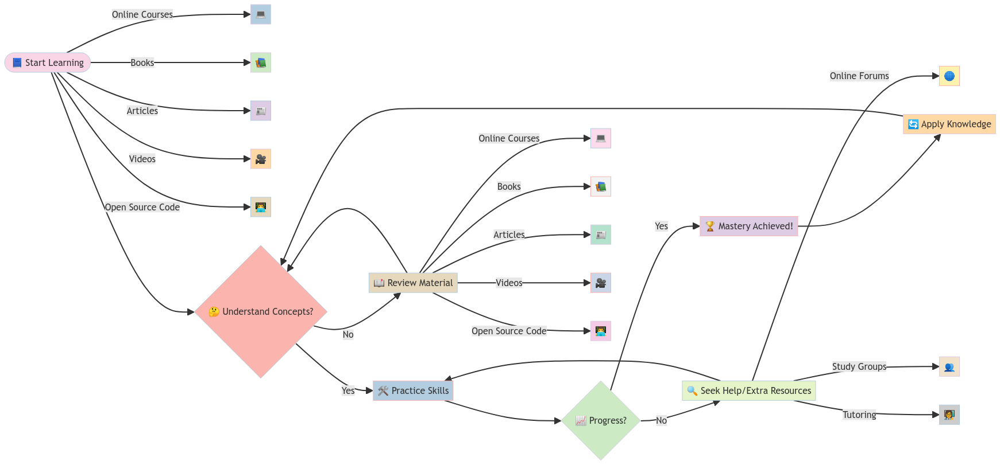

# Extra Material to Learn more about Machine Learning and Artificial Intelligence 🤖📘

## Welcome to our repository! As previously mentioned, we are curating a diverse collection of materials designed to deepen your understanding of Machine Learning (ML) and Artificial Intelligence (AI). This document will link you to various resources such as online courses, books, academic journals, articles, websites, and videos. Our goal is not only to provide you with foundational knowledge and advanced insights into ML and AI but also to inspire ongoing learning and exploration of how these technologies can be leveraged to enhance your personal and professional life. 🌎📚

Explore the Ask Sage Open-Source Community 🧠💡

_Please note that no material will be added to this document without thorough review by a member of our community to ensure accuracy and relevance. If anyone finds anything incorrect or outdated, please let us know and we will update it accordingly._

 
  

## Table of Contents
- [Extra Material to Learn more about Machine Learning and Artificial Intelligence 🤖📘](#extra-material-to-learn-more-about-machine-learning-and-artificial-intelligence-)
  - [Welcome to our repository! As previously mentioned, we are curating a diverse collection of materials designed to deepen your understanding of Machine Learning (ML) and Artificial Intelligence (AI). This document will link you to various resources such as online courses, books, academic journals, articles, websites, and videos. Our goal is not only to provide you with foundational knowledge and advanced insights into ML and AI but also to inspire ongoing learning and exploration of how these technologies can be leveraged to enhance your personal and professional life. 🌎📚](#welcome-to-our-repository-as-previously-mentioned-we-are-curating-a-diverse-collection-of-materials-designed-to-deepen-your-understanding-of-machine-learning-ml-and-artificial-intelligence-ai-this-document-will-link-you-to-various-resources-such-as-online-courses-books-academic-journals-articles-websites-and-videos-our-goal-is-not-only-to-provide-you-with-foundational-knowledge-and-advanced-insights-into-ml-and-ai-but-also-to-inspire-ongoing-learning-and-exploration-of-how-these-technologies-can-be-leveraged-to-enhance-your-personal-and-professional-life-)
  - [Table of Contents](#table-of-contents)
  - [Online Courses](#online-courses)
  - [Books](#books)
  - [Published Journals/Articles](#published-journalsarticles)
  - [Websites](#websites)
  - [Videos](#videos)
  - [Code Repositories and Examples](#code-repositories-and-examples)

## Online Courses

| Count | Name | Link to Source | Subject Focus |
|-------|------|----------------|---------------|
| 1     |ChatGPT Prompt Engineering for Developers | [DeepLearning.AI](https://www.deeplearning.ai/short-courses/chatgpt-prompt-engineering-for-developers/) | GenAI Prompt Engineering |
| 2     |Building Systems with the ChatGPT API | [DeepLearning.AI](https://www.deeplearning.ai/short-courses/building-systems-with-chatgpt/) | GenAI API |

## Books

| Count | Name | Link to Source | Subject Focus |
|-------|------|----------------|---------------|
| 1     | The StatQuest Illustration Guide to Machine Learning | [Amazon](https://www.amazon.com/StatQuest-Illustrated-Guide-Machine-Learning/dp/B0BLM4TLPY) | Machine Learning |
| 2     | Build a Large Language Model (From Scratch)| [Manning](https://www.manning.com/books/build-a-large-language-model-from-scratch) | GenAI LLM |
| 3     | Neural Networks from Scratch in Python | [nnfs](https://nnfs.io/order) | Machine Learning |

## Published Journals/Articles

| Count | Name | Link to Source | Subject Focus |
|-------|------|----------------|---------------|
| 1     | Attention Is All You Need | [arXiv](https://arxiv.org/abs/1706.03762) | Machine Learning |
| 2     | Improving Language Understanding by Generative Pre-Training | [OpenAI](https://cdn.openai.com/research-covers/language-unsupervised/language_understanding_paper.pdf) | Machine Learning |

## Websites

| Count | Name | Link to Source | Subject Focus |
|-------|------|----------------|---------------|
| 1     | Open AI Documentation     | [OpenAI](https://platform.openai.com/docs/introduction)           | GenAI       |

## Videos

| Count | Name | Link to Source | Subject Focus |
|-------|------|----------------|---------------|
| 1     |      |                |               |
| 2     |      |                |               |

## Code Repositories and Examples

| Count | Name | Link to Source | Subject Focus |
|-------|------|----------------|---------------|
| 1     |      |                |               |
| 2     |      |                |               |